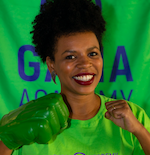

# Bem-vindxs ao meu portfólio :D





## Marylange Leal

Em transição de carreira para área de desenvolvimento de sistemas. Cursando Análise e desenvolvimento de sitemas no Centro Universitário Una.

## Sobre

[Currículo](https://drive.google.com/open?id=1VkCpCRC4dX18cCbztf3SnVA4GMGmtnmJzFPQT64SnAQ)

Meu nome é Marylange, tenho 31 anos e sou de Fortaleza - CE. Estou cursando análise e desenvolvimento de sistemas pelo centro Universitário Una. Sou formada em Enfermagem, pela Universidade de Fortaleza e pós-graduada em unidade de terapia intensiva pela Faculdade Santa Casa BH.

Fui apresentada à área de desenvolvimento de software durante a pós-graduação, a partir disso, pude enxergar um grande potencial de crescimento e oportunidades, por este motivo, resolvi mudar de carreira.

Estou estudando e praticando a linguagem C#, JavaScript através das atividades do Free Code Camp e estou cursando desenvolvimento iOS com a linguagem Swift. Participei do XP 23 do Gama Academy, durante cinco semanas tive a oportunidade de atuar como desenvolvedora front-end, realizando desafios semanais com equipes multiprofissionais.

Participei da construção do site [Cafeteria Tech](https://www.cafeteriatech.com.br), contribui na elaboração do aplicativo [Symple Pay](https://github.com/marylange/symplepay) utilizando HTML e CSS, fiz parte da elaboração do site da [Casa de Apoio Porto Esperança](https://casaportoesperanca.com.br) utilizando Wordpress, entre outros projetos. Estou cursando o 1º semestre de inglês no CAAP idiomas da UFMG.

## Formação

#### Análise e Desenvolvimento de Sistemas
Centro Universitário Una - Cursando o 2º período(noite).

**Informações Adicinais**

- Cursando desenvolvimento iOS com Swift - UNICAMP
- Estudando desenvolvimento de sistemas linguagem C#
- Curso de Inglês - 1º semestre
- Mentoria em desenvolvimento de software - Laís Gome(ThoughtWorks)
- Formação em desenvolvimento Front-End - Gama Academy
- Lógica de programação com JavaScript - EuFaria
- Lógica de programação I e II - Alura Cursos Online

#### Enfermagem
Universidade de Fortaleza - Conclusão em Julho de 2016.


## Projetos

- **JavaScript**
[Count Cards](https://github.com/marylange/freeCodeCamp)
- **C#**
[]()
- **Lógica Programação**
[Tabuada](https://github.com/marylange/Logica-Alura/blob/master/tabuada2.html), [Jogo de advinhação](https://github.com/marylange/Logica-Alura/blob/master/adivinha_mais.html), [Somando idades](https://github.com/marylange/Logica-Alura/blob/master/acumulando_valores_media_idadeFamiliares.html), [Login e senha](https://github.com/marylange/Logica-Alura/blob/master/loginSenha.html), [Cálculo IMC](https://github.com/marylange/Logica-Alura/blob/master/calculando_imc.html), [Outros](https://github.com/marylange/Logica-Alura), [Algorítmo segundo grau](https://github.com/marylange/Logica-programacao/blob/master/testeAlgoritmos.html)
- **HTML e CSS**
[Symple Pay](https://github.com/marylange/symplepay)

- **Projetos da Faculdade**
[Site de loja](https://github.com/marylange/Projetos-da-faculdade/tree/master/site%20loja%20bootstrap), [Ocultar elementos](https://github.com/marylange/Projetos-da-faculdade/tree/master/teste%20ocultar%20elementos), [Marcar texto de amarelo](https://github.com/marylange/Projetos-da-faculdade/tree/master/teste%20marcar%20texto)

## Código C#


```C#


  int numeroX, numeroY, menor, maior, soma = 0;

  Console.WriteLine("Digite um número inteiro: ");
  numeroX = Convert.ToInt32(Console.ReadLine());
  Console.WriteLine("Digite outro número inteiro: ");
  numeroY = Convert.ToInt32(Console.ReadLine());

  if(numeroX > numeroY)
  {
      maior = numeroX;
      menor = numeroY;
  }
  else
  {
      maior = numeroY;
      menor = numeroX;
  }
  for(int i = menor; i < maior; i++)
  {
      if(i % 2 != 0)
      {
          soma += i;
          Console.WriteLine($"Número: {i}");
      }
  }
  Console.WriteLine($"A soma dos ímpares é: {soma}");
  Console.ReadKey();
```

## Projetos Gama Academy

- Site [Cafeteria Tech](https://www.cafeteriatech.com.br)
- Aplicativo [Symple Pay](https://github.com/marylange/symplepay)
- Site da [Casa de Apoio Porto Esperança](https://casaportoesperanca.com.br)

## Experiência Profissional


**Contax S/A - Atendente de Telemarketing**

  agosto de 2014 a março de 2016
  
 Atividades: Atendimento ao cliente externo; Fornecimento de informações, resolução de queixas e reclamações; Disponibilização de serviços e produtos; Efetuação de vendas, captação, retenção e recuperação de clientes.
 
 
**Hospital Otoclínica - Estagiária de Enfermagem**

  janeiro de 2013 a fevereiro de 2014
  
Atividades: Classificação de risco do pacientes; Checagem dos materiais para o plantão; Atendimento ambulatorial realizando retirada de suturas, fazendo curativos e administrando medicamentos intramuscular; Administração de medicamentos receitados pelos médicos da emergência; Apresentação de casos clínicos com base em pacientes internos; Administração de vacinas para os clientes internos; Corrida de leitos para verificar os procedimentos a serem realizados no dia.


**SECVGAF - Auxiliar de Consultório Odontológico**
  
  setembro de 2006 a fevereiro de 2013

Atividades: Instrumentar os profissionais dentistas nas intervenções clínicas e
cirúrgicas; Realizar limpeza, desinfecção e esterilização de instrumentais, equipamentos
odontológicos na CME; Orientar atividades de higiene bucal; Agendar e confirmar consultas; Realizar acolhimento dos pacientes no serviço de saúde bucal; Desenvolver relatórios semanais.


## Redes Sociais


  https://www.instagram.com/marylangess/

    https://www.linkedin.com/in/maryssleal/

      https://twitter.com/Maryssleal

          marylangess@gmail.com

 
